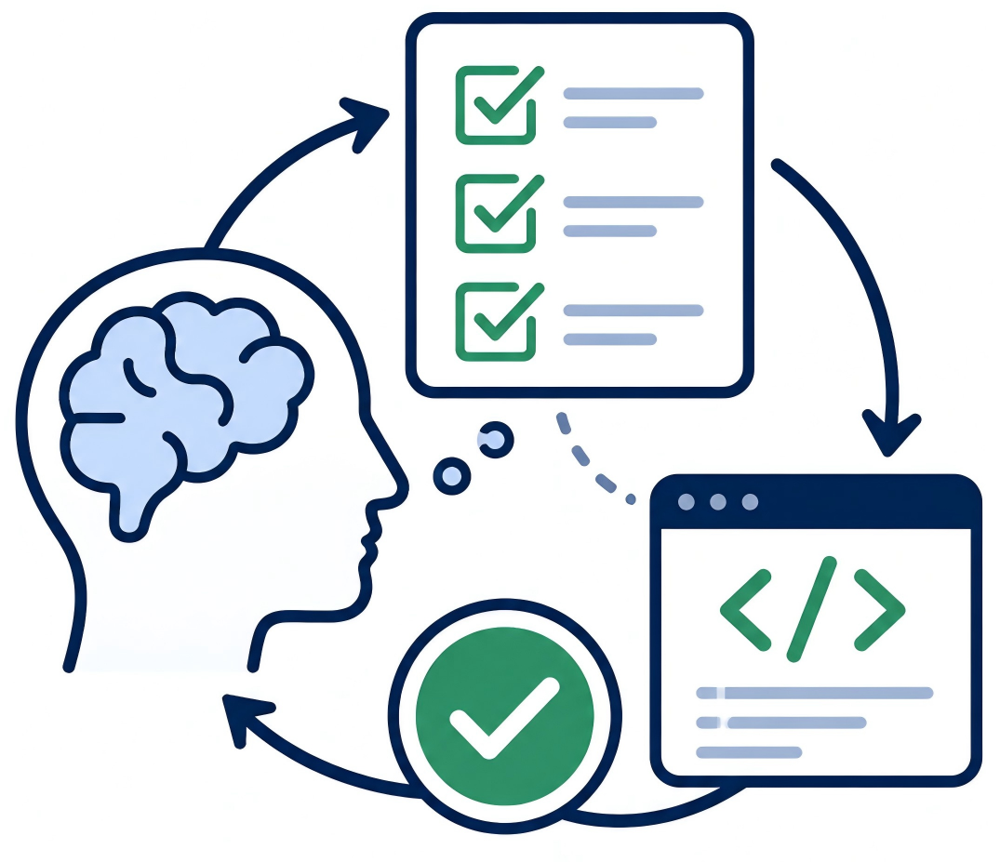
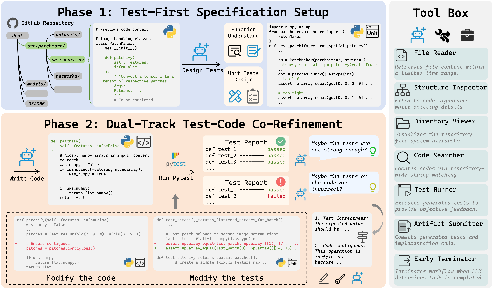

<h1 align="center">
  
  TDD-Agent
</h1>

This repository contains the code and dataset for our paper [TDD-Agent: Test-Driven Reasoning for Code Generation](https://arxiv.org/abs/2608.16742)(EMNLP 2026)



we introduced **TDD-Agent**, which operationalizes the Test-Driven Development paradigm. TDD-Agent treats test generation as a process of reasoning, compelling the model to clarify requirements and define executable boundaries prior to implementation. Through iterative refinement, our framework enables the dual refinement of both code and tests.

## 📦 Installation

```bash
conda create -n tdd python=3.12
conda activate tdd
pip install -e .
```

## 🚀 Quick Start

### 🎁 Download docker images

`RepoEval` contains 8 code repositories, we have prepared the docker images for every repository.

This script will autonomously pull all 8 images and run `pytest` in each container to check the environment.

```bash
python repo_eval/pull_and_check_docker.py
```

### ⚙️ Config your own configuration

Config your **api_key** and **base_url** in repo_eval/config/*.yaml

These yaml files contains the prompt for each methods:

```bash
repo_eval/
└── config/
    ├── tdd_agent.yaml : the config for TDD-Agent
    ├── mini_swe_agent.yaml: the config for mini-swe-agent
    └── ablation/
        ├── tdd_agent_reflect.yaml: the config for Reflect-Variant 
        ├── tdd_agent_single_track.yaml: the config for Single-Track-Variant 
        ├── tdd_agent_vanilla.yaml: the config for Vanilla-Variant
```

### 📈 Usage

```bash

# To run TDD-Agent, add your output_path to `sh/run_tdd_agent.sh`: 
cd repo_eval && bash sh/run_tdd_agent.sh

# To run mini-swe-agent, add your output_path to `sh/run_mini_swe_agent.sh`: 
cd repo_eval && bash sh/run_mini_swe_agent.sh

# To run ablation variants, add your output_path to `sh/run_ablation.sh`:
cd repo_eval && bash sh/run_ablation.sh

# To run evaluation,  add your output_path to `sh/run_tdd_agent.sh`:
cd repo_eval && bash sh/run_evaluation.sh
```


## TDD-prompt

We design a prompting variant **TDD-prompt**, which asks the LLM to formulate tests before producing the final implementation.

All prompts used are in `LiveCodeBench/config/model.yaml`

mode can be selected from :

```
['one_shot', 'cot', 'icot', 'self_plan', 'scot', 'tdd', 'tdd_ablation']
```

Run predict using:

```bash
python "LiveCodeBench/predict.py" \
    --config_path LiveCodeBench/config/config.yaml \
    --model_config LiveCodeBench/config/model.yaml \
    --mode tdd \
    --max_workers 5 \
    --inner_workers 5 \
    --max_retries 10 \
    --timeout 600 \
    --num_samples 10 \
    --output_path your-predict-path 
```

## Acknowledgements

Our implementation adapts code from [SWE-agent/mini-swe-agent](https://github.com/SWE-agent/mini-swe-agent). We thank the [OpenHands/OpenHands](https://github.com/OpenHands/OpenHands) and [SWE-agent/mini-swe-agent](https://github.com/SWE-agent/mini-swe-agent) projects for their open-source contributions.